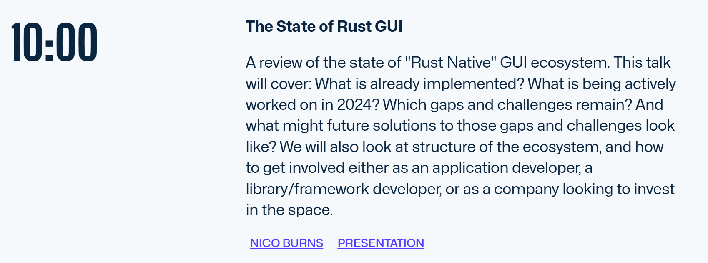

## 介绍

在去年荷兰代尔夫特举行的 [GOSIM 欧洲会议](https://europe2024.gosim.org/) 上，Nico Burns 就 Rust UI 的现状发表了演讲。
演讲材料和演讲录音可通过以下链接获取。

YouTube 演讲接：[State of Rust UI](https://youtu.be/G9vXU2oXVPw?si=Kj1bJon2bUdHWfcR)

演示文稿：[Nico_Burns-GOSIM-sorui-2024-05.pdf](https://cdn.prod.website-files.com/65d7e6309794c80135a17b0c/66424f229c41c4b4ec4f7cfb_Nico_Burns-GOSIM-sorui-2024-05.pdf)
